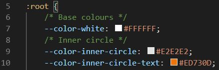
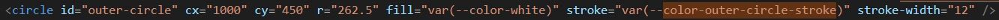
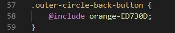
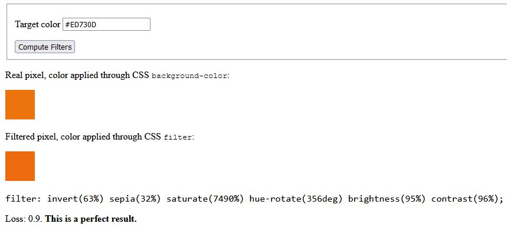
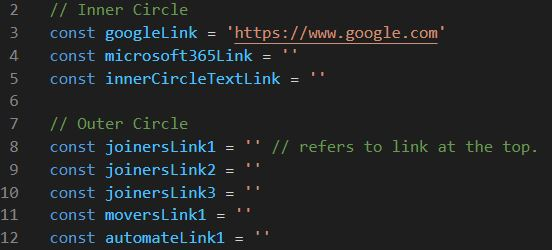
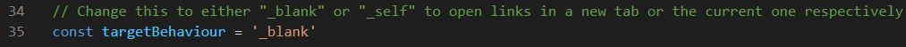

# CloudM-SVG-Animation-Widget
A widget utilizing SVG animations designed to be easily configurable for manipulating text, image colours and more. 

## Configuring colours
Modifying colours for elements that aren't images is done through the colours under :root in the CSS, the styles within that correspond to the elements. Just change the hex codes
to modify the colours they're applying on the front-end.

## Configuring image filters
Changing the colours of images requires the use of filters, I've created the current colours as filters and applied them to some sections so you can see how they're applied. When you have a
filter, create it as a @mixin under the "Filter Mixins" section of the styles.scss file and then @include them to whichever image you wish to modify.

Filtes are applicable only to classes under the Filters section in the styles.scss file, all have the "filter-" class prefix except for the back-buttons.

## Creating filters from hex codes using the filter widget
Because filters are difficult / arduous to create from scratch, I've included a widget that takes a hex code and converts it into a filter. It only creates one style for "filter" without
providing any for "-webkit" and so on, if you want these you'll just need to copy and pase with the added prefix. You can run this widget directly in the browser.

The execution of this hex to filter code is variable, there is a loss value created which will be shown under the generated filter. Ideally you want this below 1.0 as that offers an identical result.
If you run this and don't get 1.0 or it returns a particularly high loss value, just click the "Compute Filters" button again and it will eventually return an identical result after a couple tries.

## Configuring links
Links are applied to the SVG only after the whole page has loaded, these are stored in variables under the Links section of the scripts.js file. 

## Configuring target behaviour
You can change the target behaviour of all links to either open in the current tab or a new tab by modifying the "targetBehaviour" variable in the scripts.js file. 

